# Documentation for Website Portfolio - Lexus Macalalad

[Portfolio Website - Website]() 

[Portfolio Website - Source code](./src/index.html) 

[GitHub Repository](https://github.com/lexusmacalalad/Portfolio-website)  

[Presentation Video]()  

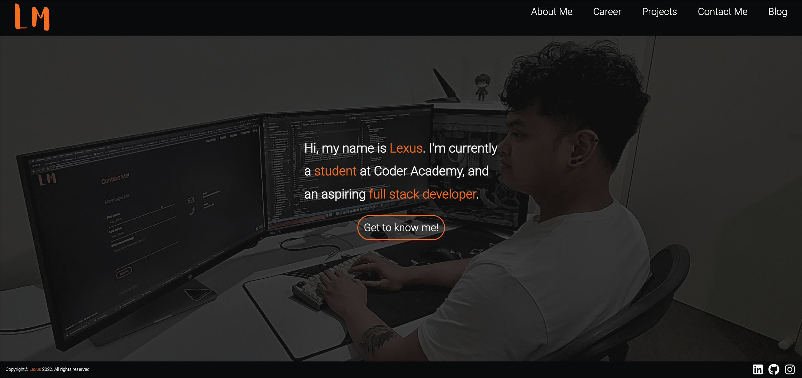

## *Purpose of Portfolio Website*
The purpose of this portfolio website is to introduce myself and be able to showcase my coding/programming skills. There are two main goals that I want my portfolio website to achieve, which are can be broken down into **user stories**:

* "**As a developer**, I want to be able to showcase what I have done throughout my coding journey and have a way for recruiters to contact me so that I have a higher chance of getting into the industry".
  
* "**As a recruiter**, I want to get to know this person and see their skills and projects they have completed because this will help me gain an understanding of whether this person is a great fit for the company".

By creating this portfolio website, I want to increase my chances of getting recognised in the industry.

## *Functionality/Features*
To be able to fulfill the purpose of my portfolio website, I will need to include some features that will help me achieve my main goal. I will also need to ensure that the portfolio website is engaging to anyone that views it. I also want my website to help me network my brand in the industry, therefore will need to include some Search Engine Optimisation features.

Therefore, the following features will be included in my portfolio website:
* **Navigation bar** to help the target audience navigate through my page, making my portfolio become organised and help direct my audience to sections they want to view.
* **Images** of myself and my hobbies or interests for my audience to get to know me better.
* **Icons** that link to my professional accounts like GitHub and LinkedIn to let my audience gain more understanding about my projects and career.
* **Buttons** that link to other sections of the page to make the page more engaging.
* **Animations** to create a nicer looking website as opposed to having a lot of the elements look static.
* **Forms** for my audience to be able to provide their contact details to me, helping me network with potential employers or collaborators.
* **Downloadable** files like my resume to let my audience know that this portfolio website was also made with the intention of getting recruited in the industry.
* **Responsive design**, where I design the website with a **mobile first** approach to ensure that my portfolio is easily viewed in mobile, tablet, and desktop view.

## *Sitemap*
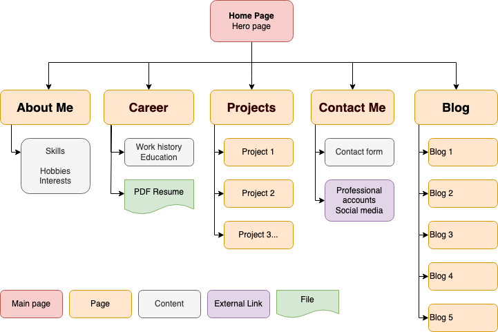

## *Screenshots*

### Screenshot of Landing / Main Page

### Screenshot of About Me Page
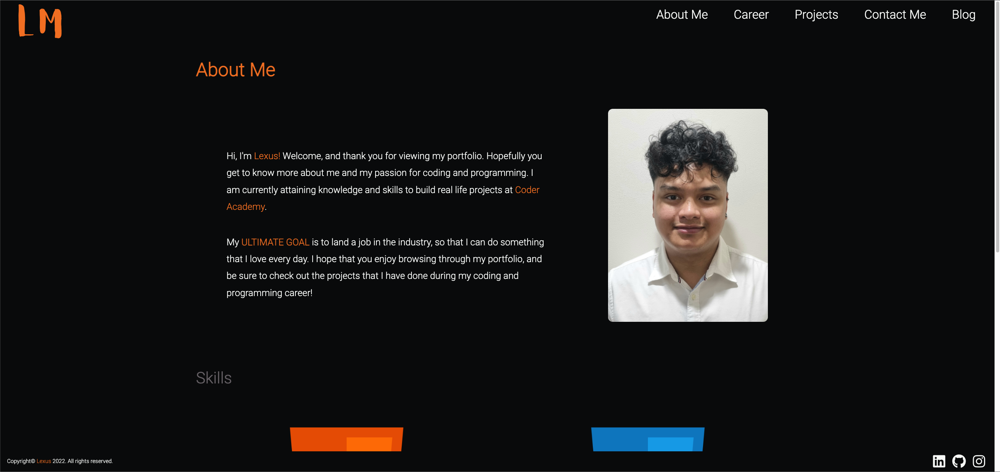

### Screenshot of Career Page
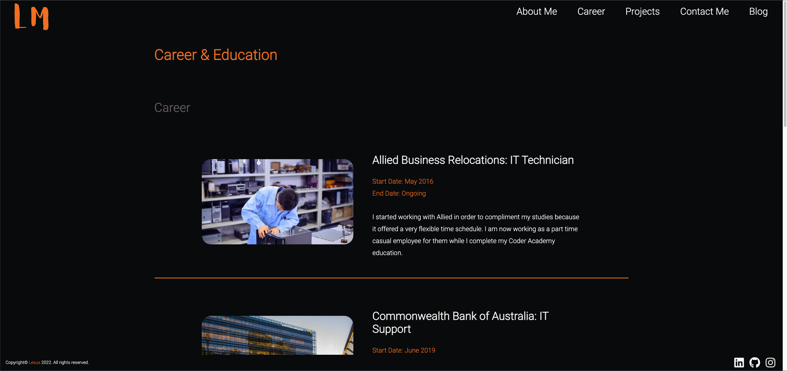

### Screenshot of Project Page
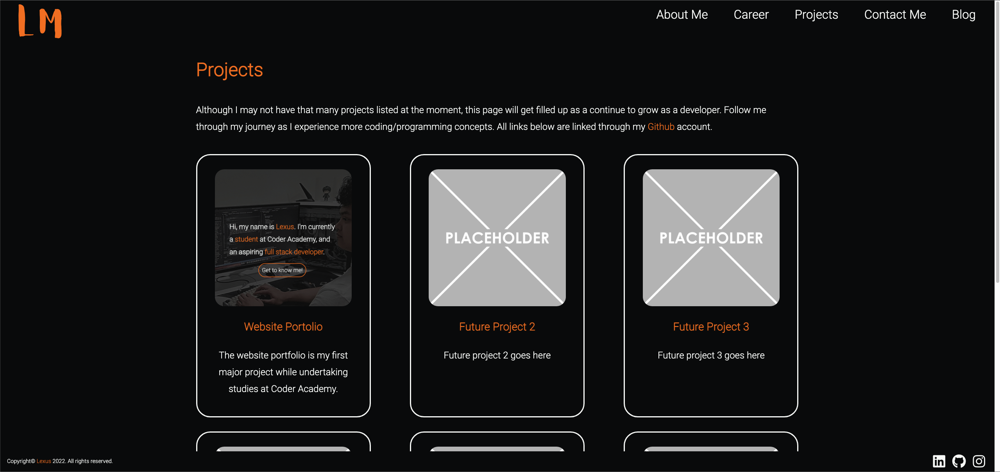

### Screenshot of Contact Me Page
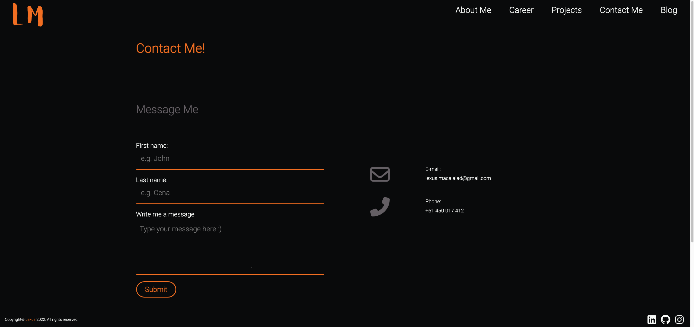

### Screenshot of Blog Page
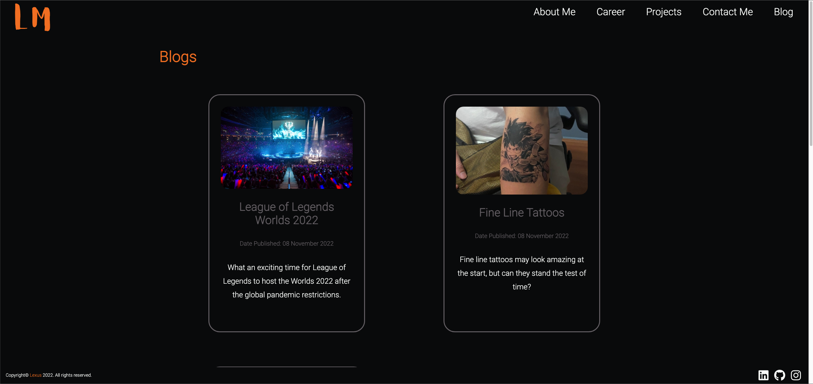

## *Target Audience*
As this portfolio is aimed at future employment in the industry, recruitment agencies or employers will be my primary target audience. 

In order to help me get into the industry, this portfolio is also targetted towards my educators, as they will be able to help me build networks and relationships with potential employers or help me get into an internship program. 

Lastly, I also want my class colleagues, family and friends to help me keep accountable with my coding/programming journey.

It is therefore required that I meet all the requirements that will allow this portfolio to stand out and be engaging to all my audiences. This will need to be made public, so anyone can access this portolfio.

## *Tech Stack*
The tech stack that will be used in the early stages of the portolio are **HTML** and **CSS** along with the **SASS** extension for styling. This will change as I gain more coding/programming skills, where I will eventually add some logic to the page (e.g. the form section in the about me page).

**Google dev tools** was used a lot to help me understand what I needed to change with my elements, most specially when playing around with margins and paddings.

I will also be using **trello board** to track my progress and for time management so I can finish the features I want included in a timely manner.
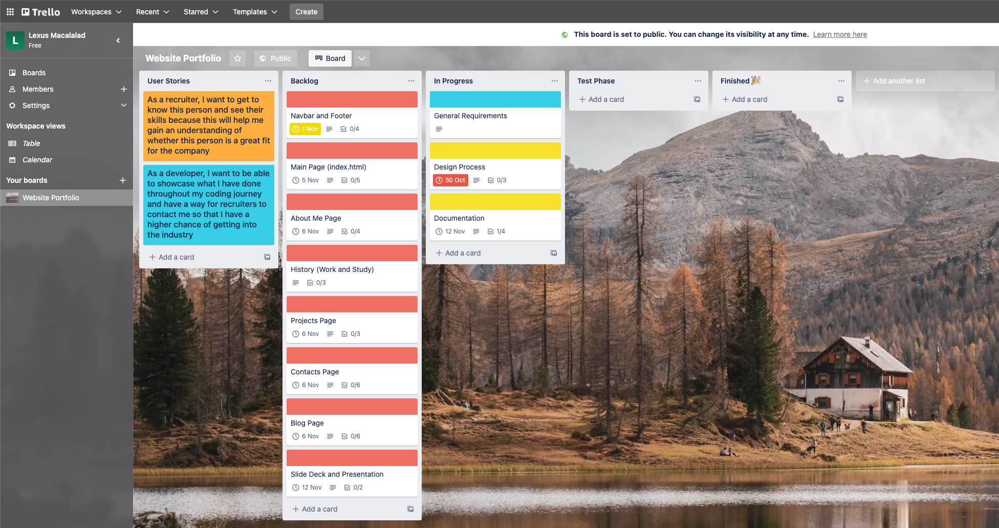

To help design my portfolio, the following is used:
* [Figma](https://www.figma.com/) or [Lucid Chart](https://balsamiq.com/) to design a low level illustration and mockup of the portfolio on different media screens.
  
* [Diagram](https://app.diagrams.net/) to design the sitemap of the portfolio in order to see how the pages interact with each other and what each page contains or link to.

* [coolors](https://coolors.co/) to find a colour palette that will complement the theme I want to achieve

* [fotor](https://www.fotor.com/) was used to edit my images, specifically my landing page because I couldn't use filters using CSS without it affecting its child elements.

* [image optimizer](http://www.imageoptimizer.net/Pages/Home.aspx) was used to optmise my images in order to make them smaller for my webpage. This was done so that the page would load a lot quicker because it doesn't have to load as many elements with a small image.

* [iloveimg](https://www.iloveimg.com/crop-image) used to crop images I wanted to include in my portfolio to make it more aesthetically pleasing.

To deploy my portfolio as a public website while I am still working on it, I will be using [Netlify](https://www.netlify.com/), but will eventually purchase my own domain when I start searching for career opportunities in this field.

## *Inspiration*
### Theme Inspiration
Growing up, I have always been interested in the outer space and space exploration. The **colour scheme** of my website portfolio will closely resemble my learning/gaming environment as it is also inspired by space exploration.
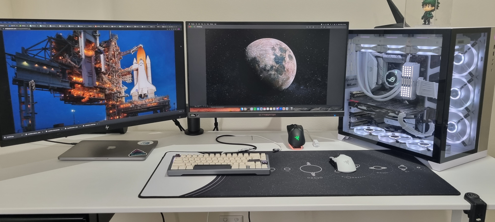

The colours I will be choosing will be **monochrome** leaning more towards the darker end of the spectrum as the main theme, and adding a bit of **orange** to make it pop.

### Design Inspiration
For the overall design of my portfolio, I want to go with a more minimalistic look. Some inspiration I found online are:
* [Simone Olivia Landing Page](https://harnishdesign.net/demo/html/simone/index.html)
  * The inspiration that I got from here is the landing page, as there isn't much happening, but it grabbed my attention and interest to explore the portfolio further.
  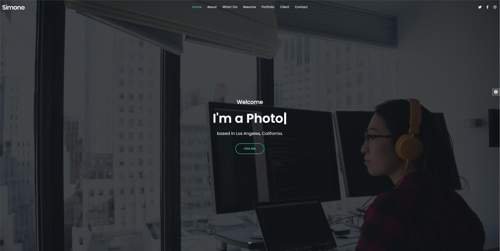

* [Propus Projects Page](https://preview.themeforest.net/item/propus-web-designer-portfolio-elementor-template-kit/full_screen_preview/30585489?_ga=2.256386635.158052106.1616312993-1741458383.1577882696)
  * Here, I really like the way they laid out their projects, as it presents a very clean and minimalistic view of all the projects that they have done. I will most likely do something very similar with my blog page for this, as I just want a card system for both the project page and the blog page
  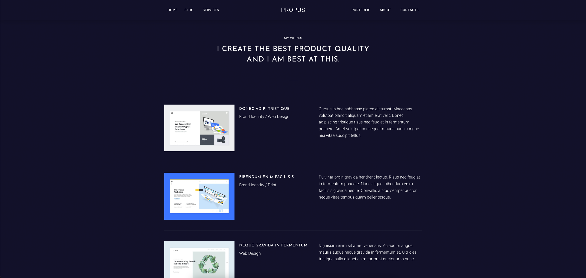

* [Jord McGowan Contact Page](https://templatekit.tokopress.com/portfoliokit/03-contact/)
  * The contact page of this portfolio is nice and simple, and will complement the theme that I am going for.
  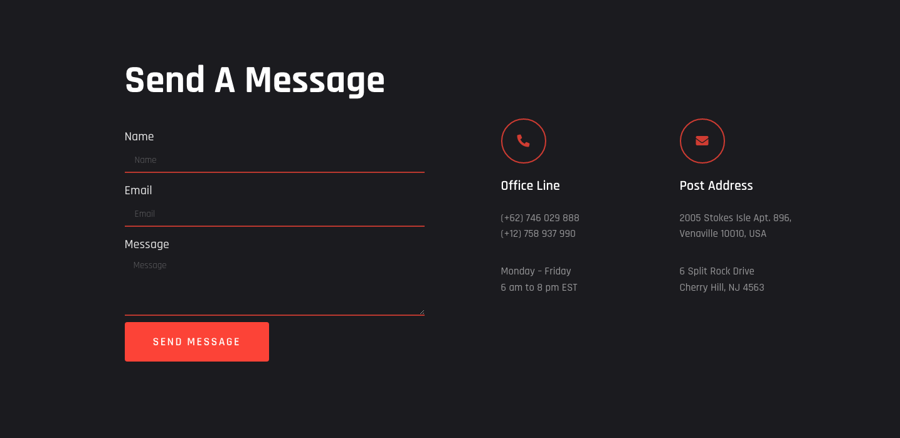

* [Propus About Me Page](https://preview.themeforest.net/item/propus-web-designer-portfolio-elementor-template-kit/full_screen_preview/30585489?_ga=2.256386635.158052106.1616312993-1741458383.1577882696)
  * I really like the layout of this about me page because it includes a photo of the author of the portolio.
  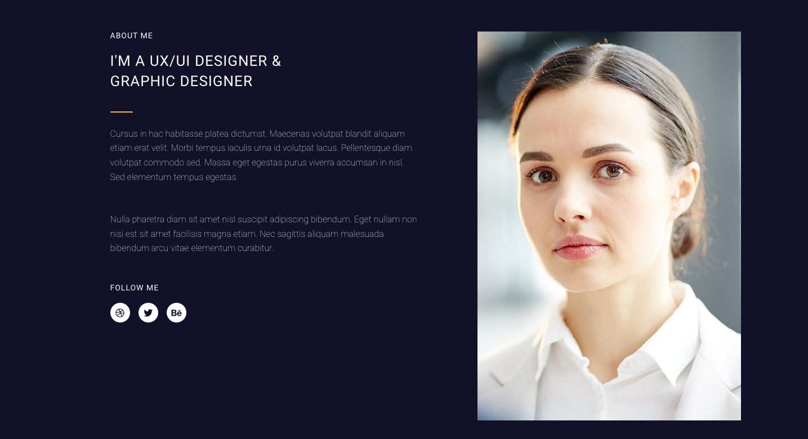

## *Design*
### Colour Scheme
The colour scheme of my portfolio was generated using [coolors](https://coolors.co/)
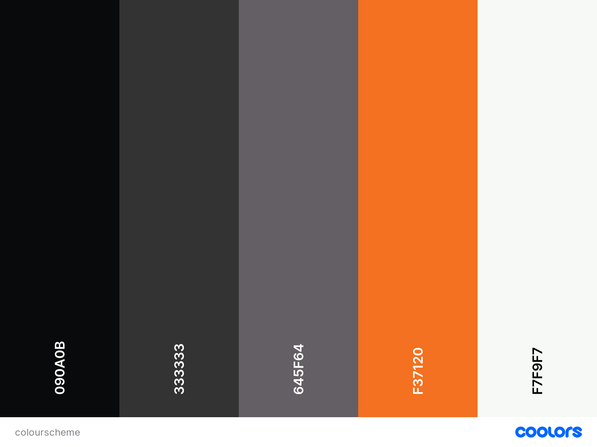
I will be using **SASS Variables** to save these colours
* $primary-color: #090A0B (black)
* $secondary-color: #333333 (charcoal)
* $space-grey: #645F64 (grey)
* $accent: #F37120 (orange)
* $light: #F7F9F7 (snow)

### Portfolio Mockup
To create my portfolio mockups in several media screens, I used [lucid chart](https://www.lucidchart.com/pages/), as I found using this website the easiest to create mockups
* Mobile View
  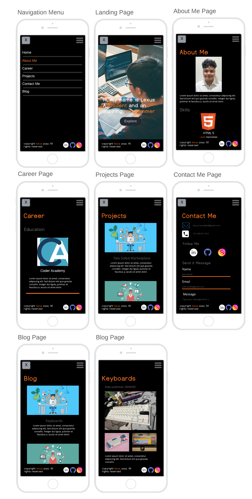

* Tablet View
  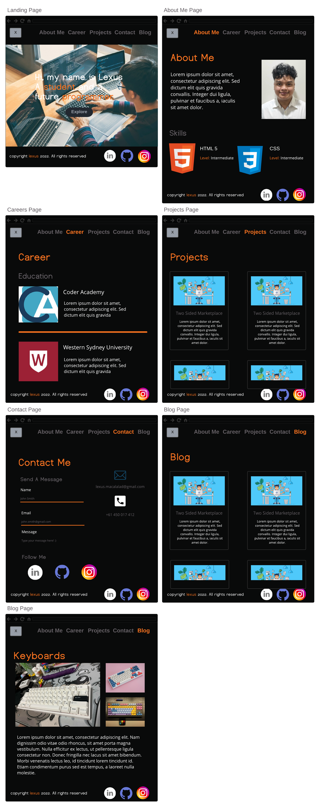

* Desktop View
  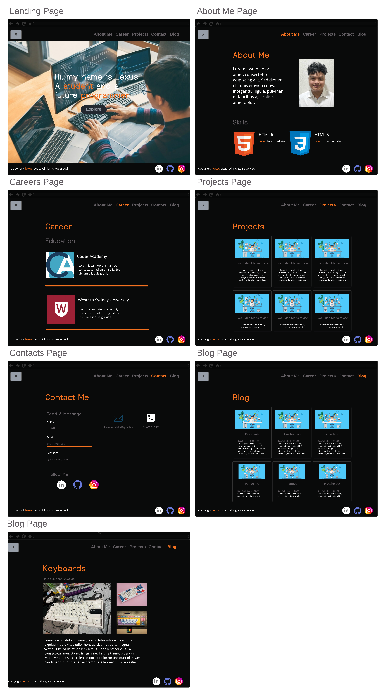

### Logo
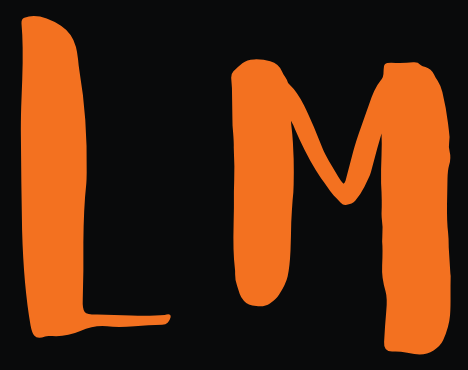
* This logo was designed using [Canva](https://www.canva.com/)

## References
[Responsive Navigation Menu](https://blog.logrocket.com/create-responsive-mobile-menu-with-css-no-javascript/) 
* Although I ran into this amazing tutorial on how to make a navigation menu responsive, I still had a lot of trouble getting it to look like my mockup, specifically the **hamburger** lines, because I wanted it more rounded than looking blocky.
* Through experimentation, I found that I can add a border radius on the hamburger line styling itself, but also add it on the 1st and last lines, including the gap between each line.
[Icons8](https://icons8.com/)
* Icons 8 was used to download some logos like the HTML and CSS logos.
